# Java Iterable

## Hierarchy Interface
 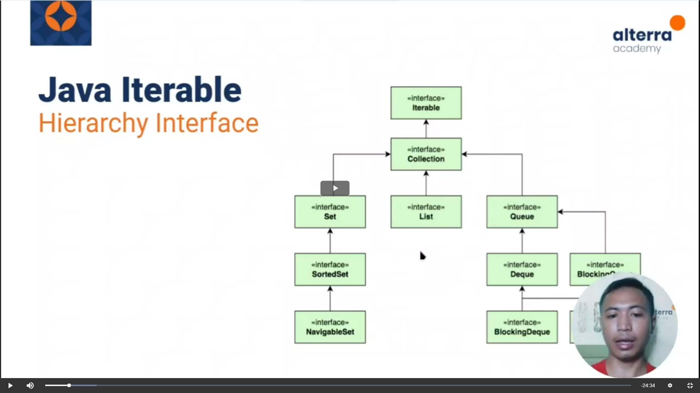

## General Implementations
 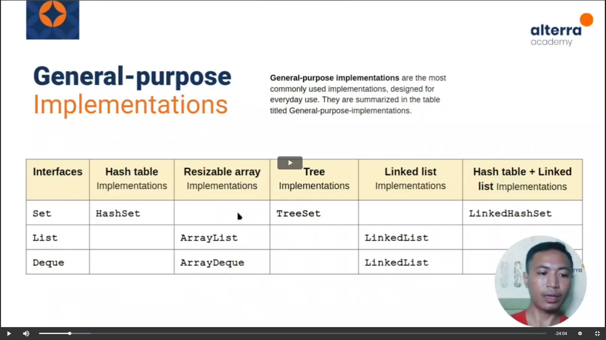

## Method Iterable

forEach
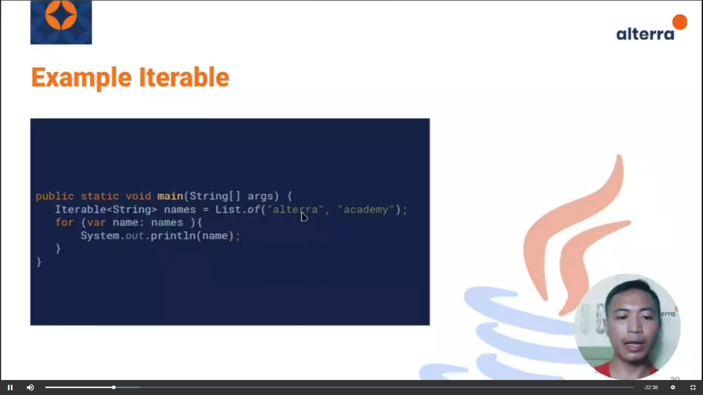

iterator
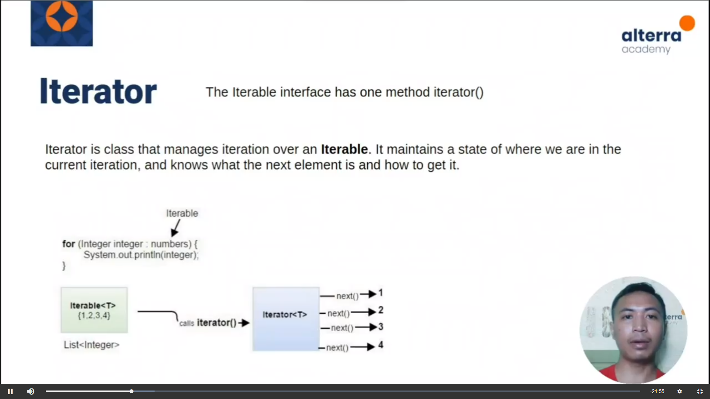
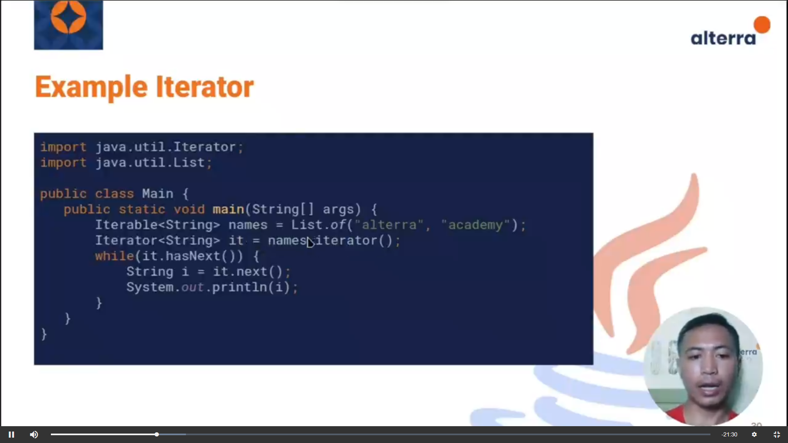

spliterator

## Collections
kumpulan objek, diletakkan dalam 1 tempat (Collections of Object)
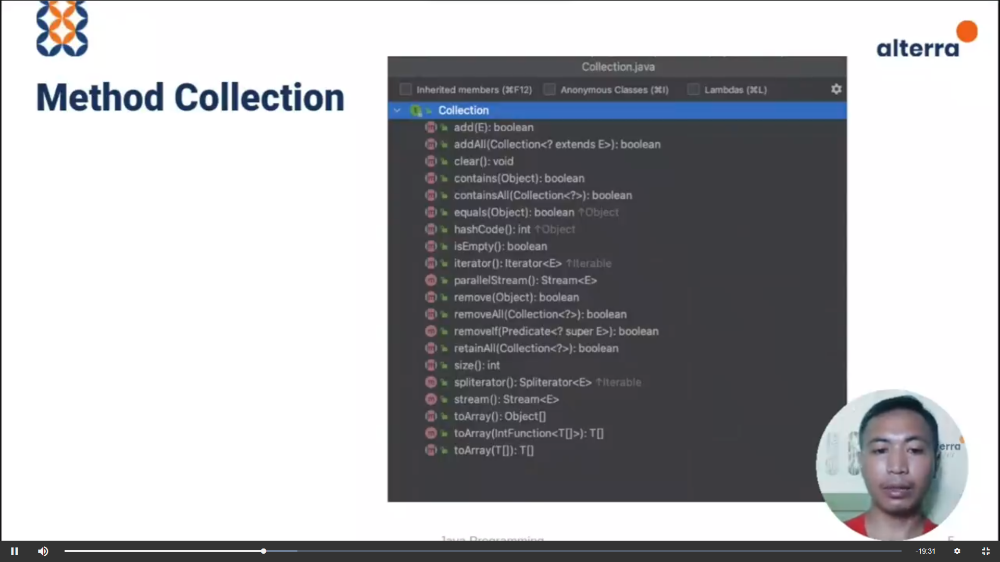
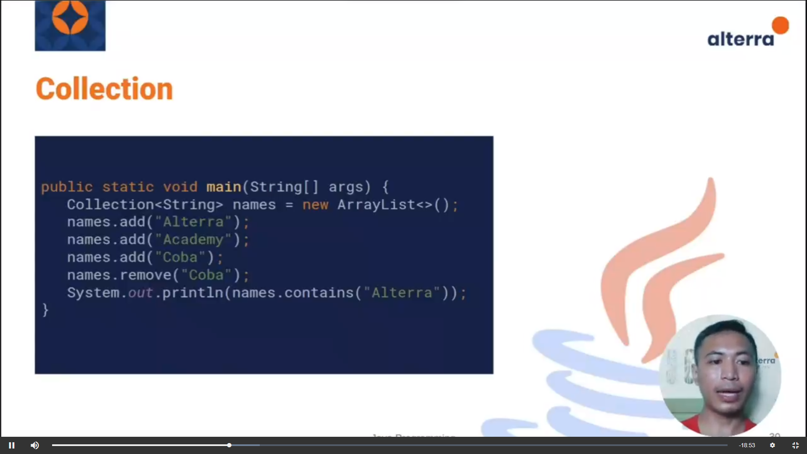

## List
- menyimpan data secara linear
- dapat menerima 2 nilai yang sama, namun tetap disimpan masing-masing
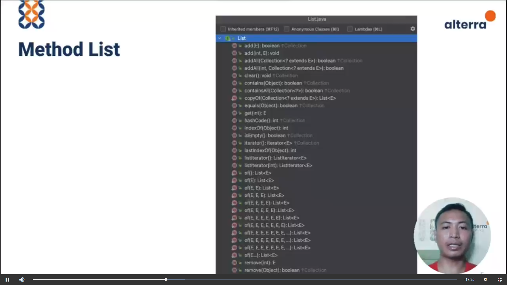

### Array List
Array yang dinamis, bisa berubah ubah kapasitasnya
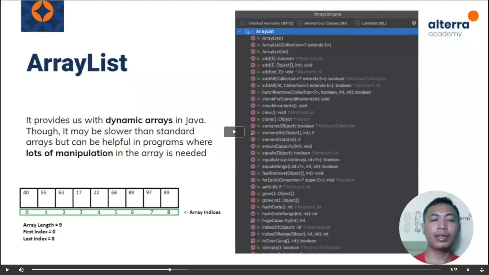

### Linked List
Setiap elemen saling terhubung
Setiap elemen menyimpan alamat memori elemen setelah atau sebelum
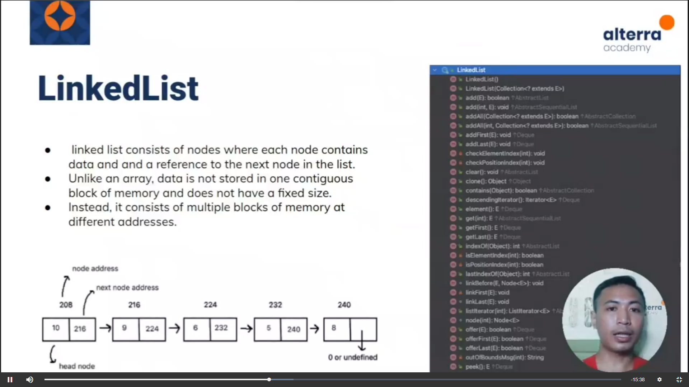

## Time Complexity
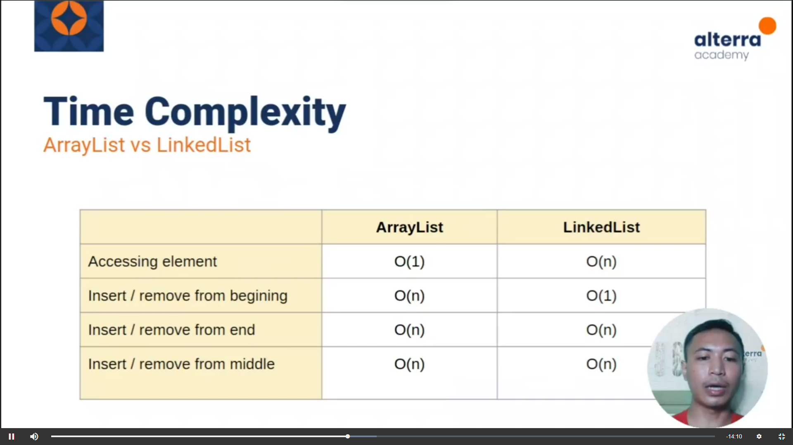

### Immutable List
List yang tidak bisa diubah datanya
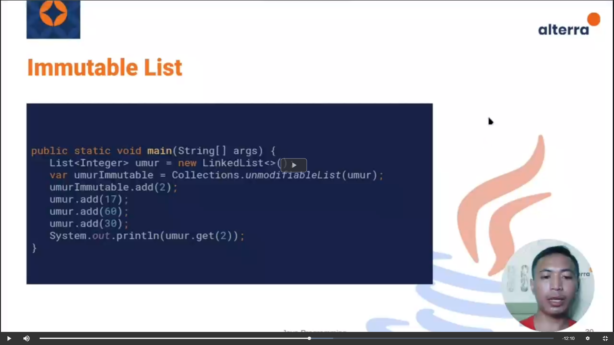

## Stack
LIFO = Last in First Out (Seperti Tumpukan)
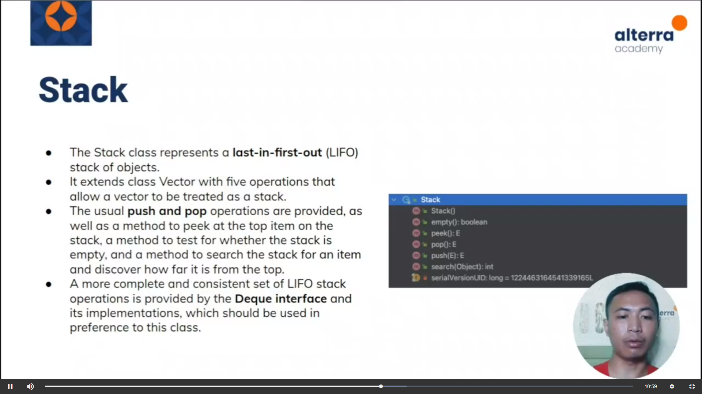

## Set
Menyimpan sekumpulan data secara linear, tidak dapat menerima data yang kembar / sama nilainya

## Comparing Set
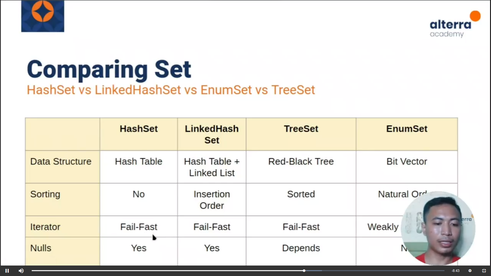

# Pengumpulan Challenge
https://docs.google.com/document/d/1UMLB1VZogb7iIcFseEnZgVYw2_XxB0Pl398hxcX8ijg/edit?usp=sharing