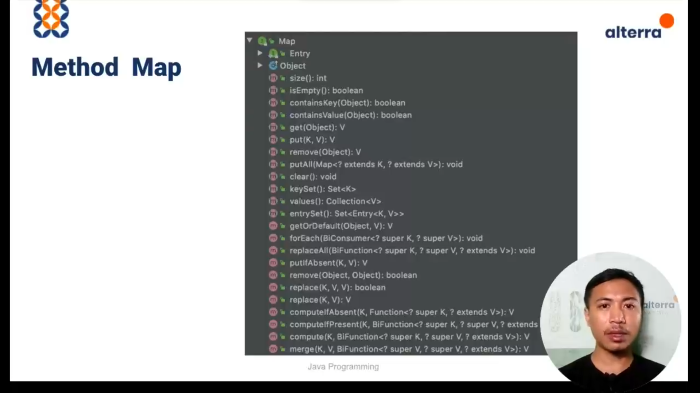
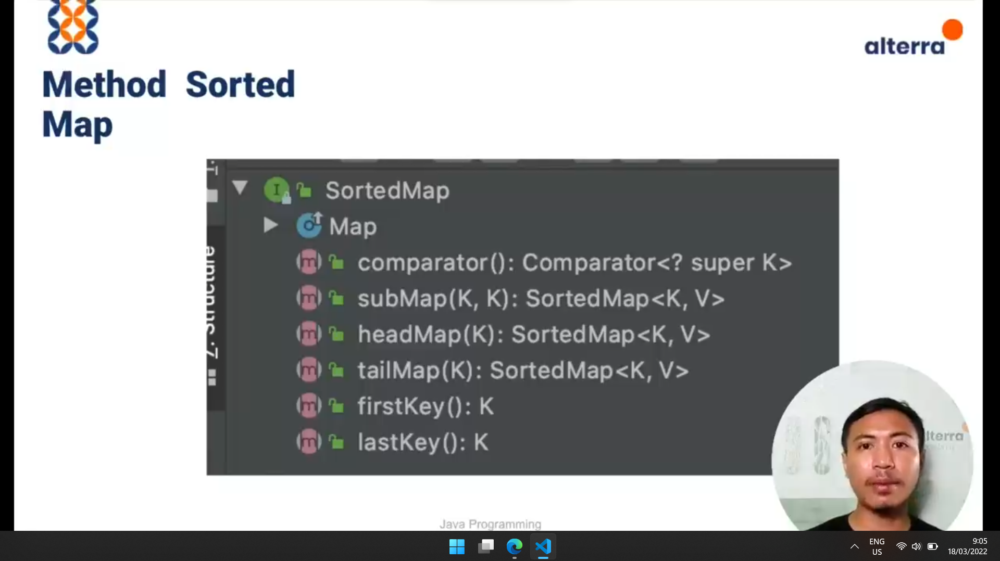
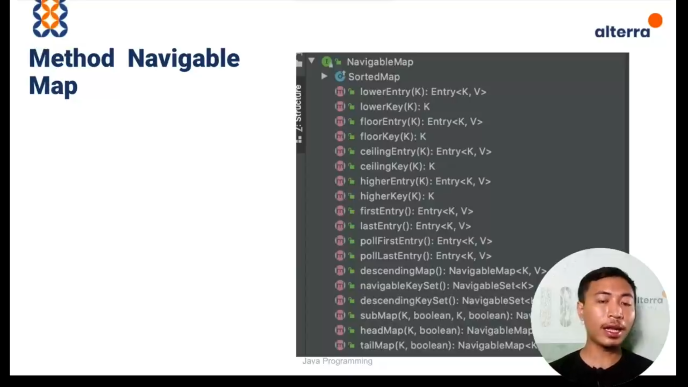

# Map

Data diidentifikasi dengan key, setiap key memiliki value.
Jadi map berbasis key value

### HashMap
Map yang menggunakan algoritma hashtable

### WeakHashMap
Key dapat dihilangkan apabila data nya tidak digunakan lagi

### Identity HashMap
Jika key memiliki referensi memori yang berbeda, maka akan dianggap sebagai data yang berbeda

### Linked HashMap
Tidak ada perbedaan dengan HashMap, secara internal menerapkan doubly Linked List dan HashTable sebagai metode penyimpanan

### ImmutableMap
Map yang tidak dapat diubah isinya

### SortedMap
Map yang dapat diurutkan

### With Comparator
Mengurutkan data yang kompleks

### NavigableMap
Sorted Map dengan navigasi yang lebih banyak

