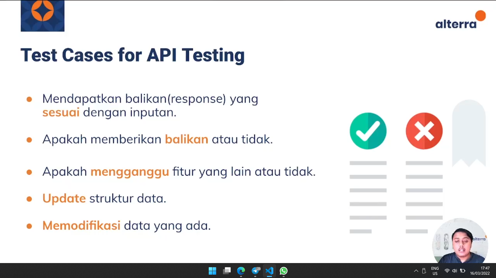

# API & REST API

- Application Programming Interface
- memungkinkan komunikasi / pertukaran data antara 2 / lebih perangkat lunak terpisah
- mempercepat proses development, mempersiapkan function secara terpisah sehingga developer tidak perlu membuat semua function pada 1 aplikasi, bisa dipisahkan ke dalam API
- Memberikan respon pada setiap request

## API Workflow

# REST API
- REST = Representational State Transfer
- Standard arsitektur komunikasi berbasis web yang sering digunakan. Menggunakan method HTTP untuk melakukan komunikasi.
- Berisi aturan yang dapat membatasi request yang dapat dilakukan aplikasi ke server, seperti tidak dapat memodifikasi database
- Terdapat Request (proses permintaan data ke server), lalu server memberikan response sebagai jawaban ke client
- Umumnya Request dan Response menggunakan format JSON

## HTTP Method
1. GET
    - Membaca / mengambil informasi yang sudah ditentukan melalui url
    - Membaca data
    - Request Get tidak dapat melakukan modifikasi pada server
2. PUT
    - Dimanfaatkan untuk membuat / memperbarui data / resource
    - Memanggil request put yang sama berulang kali menghasilkan response yang sama
3. POST
    - Mengirimkan data baru ke server
    - Dapat berisi beberapa data untuk dikirimkan ke server
    - Dapat digunakan untuk membuat resource baru atau mengirimkan data untuk diproses
    - Memanggil request put yang sama berulang kali membuat data beru setiap kali request dilakukan
4. DELETE
    - Menghapus data

## Component

### Method
- GET, POST, PUT, DELETE
### URL
- https://api.test/v2/getData()
### Header
- kumpulan field dan value, berisi token untuk autentikasi bahwa request tersebut valid
### Body
- Isi informasi

## JSON Java Script Object Notation
- Dapat dibaca oleh semua bahasa pemrograman

## HTTP Response Code
- 200 : Request yang dikirim succes
- 201 : Request yang dikirim succes, resource berhasl di buat (Post dan Put)
- 400 : Data yang dikirim tidak sesuai (Post dan Put)
- 404 : Resource yang dibutuhkan tidak ditemukan
- 401 : Kita tidak melakukan autentikasi sebelum melakukan request
- 405 : Kesalahan penggunaan method (mengupdate data menggunakan method get)
- 500 : Terdapat kesalahan internal di server

# TESTING API

1. Functionality
    - Validitas hasil response dari request yang dikirim
2. Load Test
    - Kemampuan server untuk menghandle request
3. Security
    - Keamanan server dan api

### Tools
Postman, Frisby, JMeter, Rest Assured

## Unit Test vs API Test

## Testing Process
1. Specification Review
    - Mereview kebutuhan API dan use case document
2. Specification Development
    - Memastikan detail test condition dan hasilnya di setiap test case
3. Framework Development
    - Pemilihan tools untuk melakukan API Testing
4. Test Case Development
    - Membuat test scenario dan test case
5. Eksekusi dan Report Hasil Test Case

## Type Output
- JSON, XML
- Status Response Fail atau Success

## Type of Bugs that API Testing Detects
- Gagal melakukan error handling
- Kesulitan untuk terhubung dan mendapatkan response API
- Security, Performance Issue
- Error / Warning yang tidak tepat
- Struktur data response tidak tepat

# Challenges
- Kombinasi dan Pemilihan Parameter
- Tidak ada GUI
- Harus mengetahui Parameter terleih dahulu
- Menguji error handling dari setiap API

Link Pengumpulan Challenge
https://docs.google.com/document/d/1R8gWiOScwlTOPdoAJPVHmXS3NQ4tBVcPvAoKY_BbnDk/edit?usp=sharing