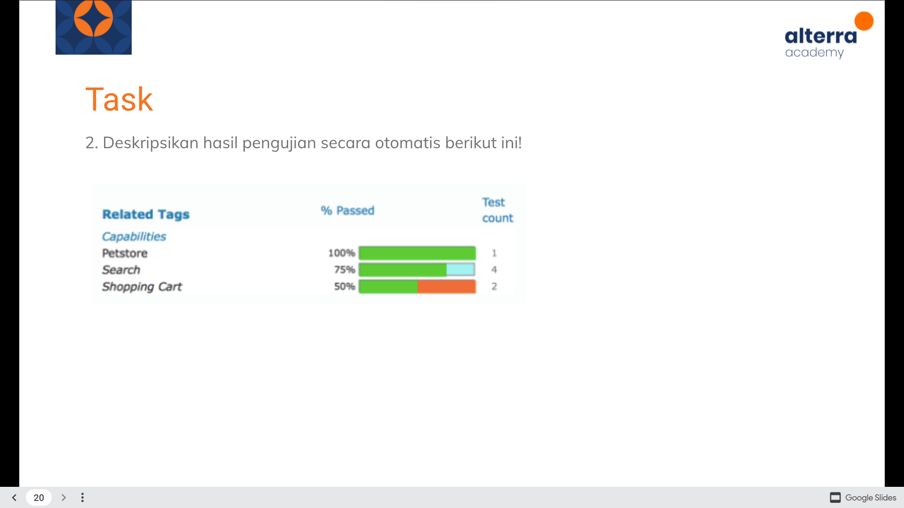

# From Manual to Automation Testing

## Manual Testing
- Test case yang dieksekusi oleh tester (manusia) dan perangkat lunak bantu.
- Berperan pada pengujian visual, tidak dapat di otomasi karena menilai visual hanya dapat dinilai oleh manusia
> Objective : Explorasi dan Observasi Manusia

### Kelebihan
- Mendapatkan visual feedback tampilan UI
- Lebih murah karena tidak perlu biaya tools automation dan proses
- Dapat secara langsung mendapatkan feedback dari tester untuk mengetahui kelebihan dan kekurangan
- Perubahan kecil tidak memerlukan produksi kode lagi karena hanya perlu mengubah cara / langkah pengujian

### Kekurangan
- Kurang teliti (Human Error)
- Tidak dapat direkam, tidak dapat digunakan ulang kembali (not reusable)
- Jika QA tester sudah familiar, dapat menimbulkan bias dan kelelahan fokus karena sudah terbiasa dengan alur aplikasi

## Automation Testing
- Menggunakan alat otomasi untuk mengeksekusi test case
- Perlu menulis script terlebih dahulu
> Objective : Efisiensi dan Coverage

### Kelebihan
- Dapat menemukan bug lebih banyak daripada manual testing
- Script dapat menemukan bug yang tidak ditemukan manual tester
- Script dapat mengeksekusi test case lebih cepat daripada tester
- Script dapat digunakan berulang kali

### Kekurangan
- Lebih mahal (Tools)
- Kurangnya human element (Tidak dapat menguji kontrast, pemilihan warna dan font, UI)

- Automation Testing adalah cara terbaik untuk meningkatkan efektifitas, cakupan pengujian, kecepatan eksekusi dalam testing
- Beberapa alasan pendukung :
    1. Manual testing memakan waktu
    2. Sulit untuk menguji situs multi bahasa secara manual
    3. Automation Test tidak memerlukan campur tangan manusia
    4. Automation Test meningkatkan kecepatan testing
- Penting karena beberapa faktor berikut :
    1. Fleksibilitas
    2. Kecepatan
    3. Coverage / Cakupan
    4. Error Avoidance

## Which Test Case to Automate
1. Executed Repeatedly
2. Difficult to perform manually
3. Time consuming to perform manually

## Which Test Case NOT to Automate
1. Newly Designed, never executed manually at least once
2. Frequently changing Requirement

## Test Tool Selection
Bergantung pada Usability,Simplicity,Cost

## Define Scope of Automation
Area aplikasi yang akan di test secara otomasi :
1. Fitur penting bisnis
2. Skenario yang memiliki banyak data
3. Fungsional Umum di seluruh aplikasi
4. Kelayakan Teknis
5. Sejauh mana komponen bisnis digunakan kembali
6. Kompleksitas Test Case
7. Kemampuan Test Case yang sama untuk pengujian lintas browser

## Planning, Design, Development
Membuat strategi automation dan rencana, developing automation script
Kesiapan test plan automation, jadwal testing, report testing

## Test Execution
Menjalankan script, membutuhkan input test data
Setelah eksekusi, akan mendapatkan report hasil testing

## Maintanance
Fase menguji fungsionalitas baru yang ditambahkan dapat diuji dengan baik atau tidak
Meningkatkan efektifitas script automation

## Best Practices
1. Determine details Scope of Automation
2. Select the right automation tools
    - Dipilih berdasarkan kebutuhan test
3. Scripting Standards
    - Standard yang harus diikuti saat produksi code script
    - Error handling & message
4. Measure Metrics
    - persentase bug yang ditemukan, waktu testing, indeks kepuasan user

# Challenge

- Dilakukan Test CRUD pada sample REST API
#4 DELETE posts example
    Melakukan testing pada API, menggunakan method DELETE (menghapus posts) memerlukan waktu eksekusi selama 880 milisecond
#2 GET posts example
    Melakukan testing pada API, menggunakan method GET (mendapatkan posts) memerlukan waktu eksekusi selama 212 milisecond
#1 POST posts example
    Melakukan testing pada API, menggunakan method POST (menghapus posts) memerlukan waktu eksekusi selama 786 milisecond
#4 UPDATE posts example
    Melakukan testing pada API, menggunakan method PUT (menghapus posts) memerlukan waktu eksekusi selama 764 milisecond

- Testing pada API Petstore lulus 100%
    artinya API bekerja dengan baik, tidak ada bug ditemukan
    Test Count 1 -> hanya melakukan 1 pengujian

- Testing pada API Search lulus 75%
    artinya API bekerja dengan cukup baik, terdapat bug ditemukan
    Test Count 4 -> dilakukan 4 pengujian
    Dari 4 Test, 3 yang passed, 1 fail

- Testing pada API Shopping Cart lulus 50%
    ditemukan bug pada API
    Test Count 2 -> dilakukan 2 pengujian
    Dari 2 Test, 1 passed, 1 fail