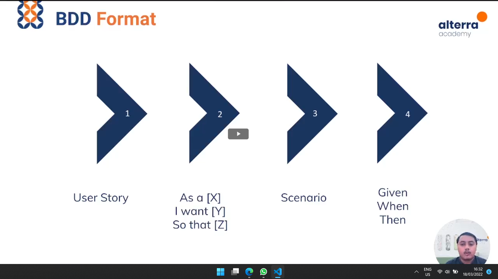

# What is BDD

### TDD
    - Menuliskan Test Case sebelum development, berfokus pada komponen sistem
    - Test Case ditulis dalam bahasa pemrograman

### BDD
    - Juga menerapkan Test First namun berfokus pada hal yang berbeda
    - Akan dituliskan berbagai scenario yang menjelaskan behavior sistem dari perspektif pengguna
    - Dituliskan menggunakan bahasa yang mudah dipahami oleh seluruh pengembang sistem
    - Bertujuan untuk meningkatkan komunikasi dan kolaborasi antar stakeholder, tim bisnis maupun teknikal
    - Memastikan setiap fitur dapat dipahami dengan baik oleh seluruh anggota tim
    - Komunikasi yang baik dilakukan untuk menyatukan pemahaman
    - Agar fitur yang ada dapat memenuhi kebutuhan pengguna sehingga menghasilkan bisnis value

### Prinsip Dasar BDD
> Menjelaskan Behavior Sistem tanpa menjelaskan implementasinya secara detail

Terdapat pemisahan antara penjelasan mengenai behavior dan implementasi
Dalam BDD, stakeholder teknikal dan nonteknikal berkolaborasi mendefinisikan kebutuhan pengguna dan kebutuhan fungsional sistem yang dituliskan melalui feature files
Deskripsi dalam feature files berperan sebagai test logic yang digunakan tester untuk menjadi dasar penulisan test case

### Feature Files ditulis dengan bahasa berkhin

1. Menjelaskan User Story
    - menjelaskan kebutuhan pengguna dan fungsionalitas sistem yang diharapkan
2. Menuliskan Scenario
    - menggunakan berkhin sintaks, berdasarkan user stories
3. Mengimplementasi user story sebagai test steps

### 3 Keyword Utama BDD
1. Given
    - Menjelaskan konteks skenario 
2. When
    - Menjelaskan tindakan yang dilakukan oleh user
3. Then
    - Menjelaskan outcome dari tindakan yang dilakukan user