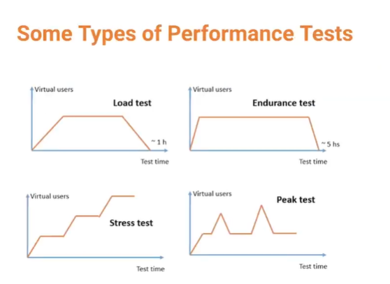
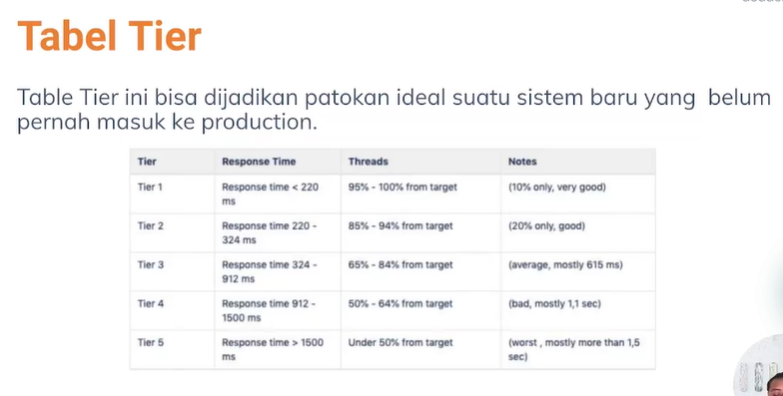
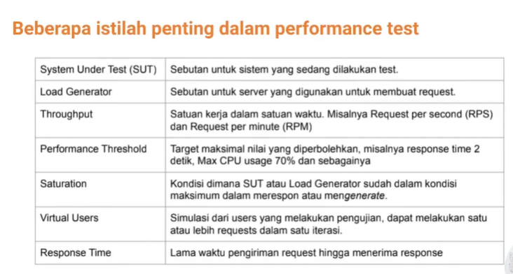

# Performance Test

### Apa itu ?
- Teknik non functional testing untuk menentukan parameter sistem dalam hal responsif dan stabilitas dibawah beban kerja
- Mengukur kualitas sistem seperti stability, ketahanan, resource usage
- Hasil pengujian : number of virtual user, transaction per second, error rate, average respond time
- Perlu memperhatikan apakah performance memenuhi harapan bisnis yang di expect
- Apabila kurang memenuhi, diperlukan pengembangan pada isu yang ditemukan ketika testing
- Pada event diskon ecomerce, hasil performance testing sangat penting karena development team bisa memastikan seberapa kuat aplikasinya
- Hasil performance testing menentukan bagian mana yang perlu di improve untuk memenuhi kebutuhan dan kestabilan

### Apa yang diukur
1. Suatu aplikasi sampai batas tertentu
2. Bukan merupakan functional test
3. Bisa dalam berbagai bentuk untuk memahami reliability, stability, availability pada environment
    - Mengamati response time ketika menjalankan request dalam jumlah banyak
    - Melihat suatu sistem berinteraksi dengan data yang besar

### Performance Test jarang dilakukan karena
- Cukup mahal untuk dijalankan, namun dapat dijadikan tolak ukur apakah sistem mampu mengakomodasi traffic yang ada
- Pengujian memerlukan persiapan, beberapa kasus harus membuat environment terpisah dari production agar tidak tercapur antara data test dan production
- Environment tersebut juga dapat dibuat di cloud yang biayanya lebih besar dari environment production

### Yang harus diperhatikan
- throughput dan response data

### Contoh Performance Test

1. Membuat Test Plan
    - Kenali kebutuhan
        - Endpoint yang akan ditest (/login, /beli_pulsa, /cek_out)
        - Kebutuhan data masing-masing endpoint (Username dan password untuk endpoint /login, dll)
2. Menentukan Metode Test
    - Pilih berdasarkan kondisi, apakah sudah pernah di test atau belum
    - Awali dengan load test untuk mengetahui kondisi awal sistem
    - Pilih berdasarkan situasi yang akan dihadapi.

1. Smoke Testing
    - Dilakukan setelah software di build
    - Memastikan fungsi penting dari program berjalan dengan baik
    - Dilakukan sebelum fungsional testing / regresi dijalankan
    - Memverifikasi fungsional kritis sistem berjalan dengan baik
    - Dapat melakukan reject aplikasi yang rusak sejak awal development
    - Contoh : fungsional login, UI responsi, dll

2. Load Testing
    - Memahami perilaku sistem dalam keadaan beban tertentu
    - Mengukur kepentingan bisnis saat transaksi penting
    - Monitoring terhadap database dan API
    - Menentukan kelayakan aplikasi pada kondisi normal dan puncak

3. Stress Testing
    - Memverifikasi kemampuanm, keandalan, kestabilan sistem
    - Mengukur penanganan error dalam kondisi berat
    - Dapat dipastikan sistem tidak akan crash pada situasi kritis
    - Memeriksa perilaku sistem setelah terjadi error atau mengalami kondisi ekstrim

4. Spike Testing
    - Mirip Stress Testing, namun jumlah stress langsung dinaikkan melebihi puncak dalam waktu singkat
    - tidak diberikan waktu untuk scale out
    - saat flash sale di ecomerce, banyak pengguna mengunjungi satu halaman

5. Soak Testing
    - Menjalankan sistem pada beban tinggi dalam waktu lama ( lebih dari 1 jam )
    - Untuk mengetahui reliability saat keadaan puncak dalam jangka panjang
    - Mengetahui bug, memory leaks dan db connection
    - Dilakukan pada jam sepi ketika tidak ada transaksi apabila dilakukan pada production

