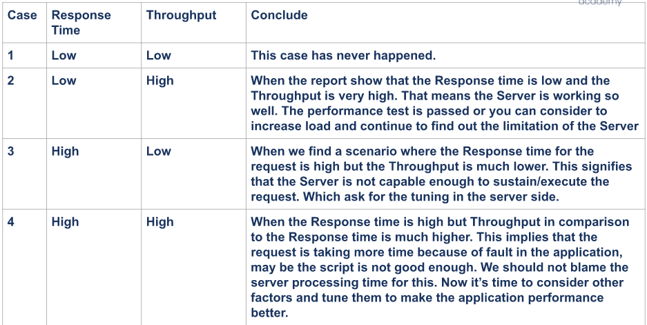

## Summary Report
## Aggregate Report
## Throughput
- Throughput = jumlah request / total waktu * konversi
- total waktu = waktu memulai sample terakhir + waktu load sample - waktu mulai sample pertama
- konversi : unit nilai konversi, contoh 1000 akan mengkonversi nilai ke detik. 1000 * 60 akan mengkonversi nilai ke menit

## Analisa Cepat

## Overview Of a Performance Test Report
1. Pembahasan Data Yang Sudah Dimiliki
    a. Summary tentang sistem
    b. Kondisi awal sistem
    c. Target yang ingin dicapai
2. Data Performance Test Yang didapatkan
    a. Masukkan data dari metrics yang didapatkan
3. Interpretasi Data Performance Test
    a. Interpretasi hasil dari metricsnya
4. Saran
    a. Berikan saran agar sistem lebih baik lagi setelah dites

## Case studies of Performance Testing

Usage in e-commerce
1. Know current normal load / capacity
  a. New features added
2. Know the capacity on a special event
  a. Usual special event (cth. Lebaran)
  b. Quick special event

Usage in payment gateway
1. Know current normal load / capacity
  a. New features added
  b. Just checking :)
2. Know the capacity on a special event
  a. Usual special event
  b. Quick special event

