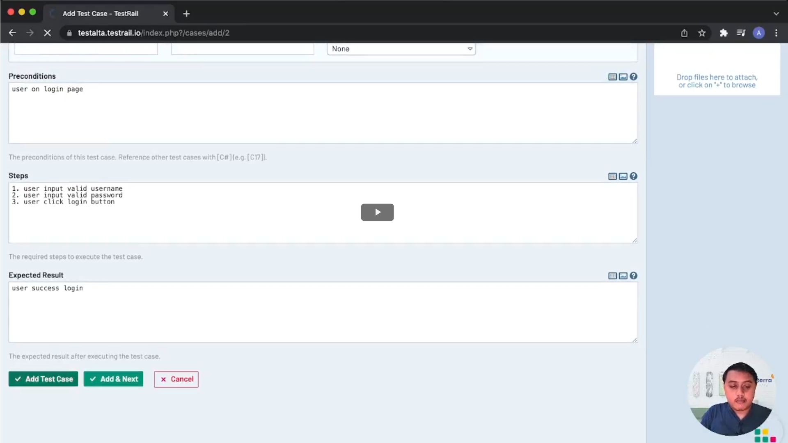

### Test Case Management Tools

## Why we need it ?

- Plan and Estimate
    - Fitur apa saja yang di test dan yang tidak di test pada planning tersebut
    - Hal hal yang berhubungan dengan test
    - Sumber daya yang dibutuhkan untuk melakukan test
    - Informasi testing

- Monitoring and Controlling
    - Monitoring Process Collecting, Recording dan Reporting

- Reporting and Integrate with another tools
    - Tidak perlu membuat dokumen report secara manual
    - Dapat diintegrasikan dengan tools lain seperti JIRA, Flag dan lainnya

## Examples
Test Rails, Test Link, Zephyr, qTest, PractiTest, TcLab

## How to use TestRail
1. Login
2. Add Project
    [AddProject](./screenshots/01 add project.png)
3. Input Project Name
4. Choose use a single repository for all cases
5. Add Milestone
    Mile Stone : target penting seperti pengujian internal, rilis beta baru, dll
    - Name, References, Parent, Description, Start Date, End Date
    
6. Add Test Run
    Tab "TEST RUNS & RESULTS"
    - Untuk mengesksekusi Test Case didalam Milestone yang sudah ditentukan
    - Name : Test Run + Date, choose Milestone, Assign to team member, description
    - include all test : Run all test cases
    - select specific test cases : choose test cases to run
    
7. Add Test Plan
    Blueprint untuk melakukan testing
    Dokumen yang berisi rencana semua kegiatan testing (Dynamic Document)
    Fill Name, Milestone and Description
    
    
8. Add Test Case
    Fill Title, Section, Template, Type, Priority, Automation Type
    - Preconditions     : kondisi sebelum dilakukan testing
    - Steps             : langkah-langkah testing
    - Expected Result   : hasil yang di expect dari testing
    
    
9. Add Result after testing
    