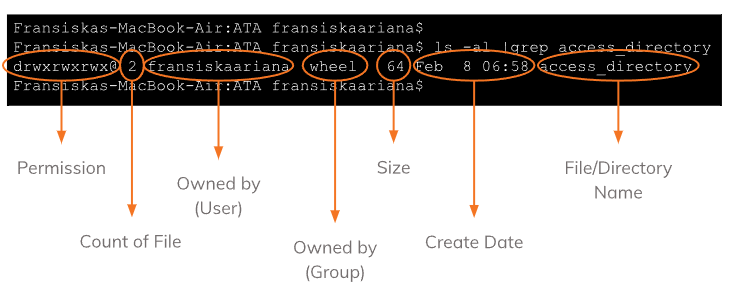

# Basic Linux Commands

## Introduction Linux Commands

- Sebuah Utilitas/Tools pada Linux, dapat dijalankan di terminal Linux
- Commands = perintah untuk berinteraksi dengan OS Linux, mirip dengan command prompt pada Windows
- Linux Commands is case sensitive : sensitive terhadap huruf besar dan huruf kecil
- Command Line is text-bases, faster than using GUI
- Advantages :
    1. Less Resources -> ringan untuk digunakan
    2. Repetitive Task Friendly -> dapat melakukan scripting untuk melakukan tugas yang sama berulang kali
    3. Powerful -> lebih stabil daripada GUI

## Linux Command Structure

> command [options] [parameters]
ls -a/usr
cd ..

## Kind Of Commands Linux

### File System Commands
touch /home/usr/doc/html
    membuat file baru kosong, dengan ekstensi file html 
    cat <nama.ekstensi file>
    membuat daftar konten/isi file pada standard output
cp test.jpg /home/usr/picture
    menyalin file dari directory saat ini ke directory lain
mv [nama file] /home/user/
    memindahkan file
mv [nama file] [nama file]
    bisa juga untuk mengubah nama file
rm
    menghapus directory beserta isinya, sebelum menjalankan command lebih baik cek dulu directory saat ini sedang berada dimana
mkdir music
    membuat direktori baru
rmdir
    menghapus direktori yang kosong
cd
    berpindah direktori
pwd
    mencari tab dari direktori yang kita gunakan saat ini

### Process Controls Command
top
    menampilkan proses yang sedang berjalan, penggunaan CPU tiap proses
    pengawasan resource system sangat disarankan
clear
    membersihkan terminal saat sudah ada banyak command
history
    mengecek kembali command yang sudah dijalankan sebelumnya

### Utilities Program Commands
ls
    menampilkan semua file pada current directory
which
    mencari file yang dapat dieksekusi
sudo
    super user do, untuk menjalankan task yang memerlukan permission root
find /home/doc test.txt
    mencari file dan directory
    mencari file dalam suatu lokasi

### File Access Permissions
chmod
    membaca, menulis dan menjalankan permission
chown linux@user2 file.txt
    mentransfer kepemilikan file ke user lain

## drwx rwx rwx

d / -   File type
        -, indicates regular file
        d, indicates directory
rwx     Read, Write, Execute permissions for the file owner
rwx     Read, Write, Execute permissions for the group owner of the file
rwx     Read, Write, Execute permissions for all other users

# Shell Script
-Shell Script, bahasa pemrograman yang dicompile berdasarkan command shell
- Shell, menjembatani user dan kernal
- Keuntungan : tidak harus menunggu command pertama selesai di eksekusi, dapat menuliskan beberapa command sekaligus lalu mengeksekusi semuanya

echo '#!/bin/sh' >> my-script.sh
menambahkan '#!/bin/sh' ke my-script.sh